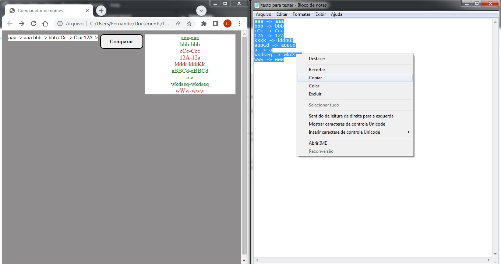

# analisador-lista-de-nomes
Aplicação feita em HTML, CSS e Javascript puro que tem como objetivo comparar uma lista de nomes digitados pelo usuário com uma lista de nomes fornecida por um programa, através disso a aplicação identifica as divergências para posterior correção pelo usuário, antes da aplicação essa tarefa era feita manualmente com isso muitas vezes nomes ficavam incorretos gerando problemas nas próximas etapas.

